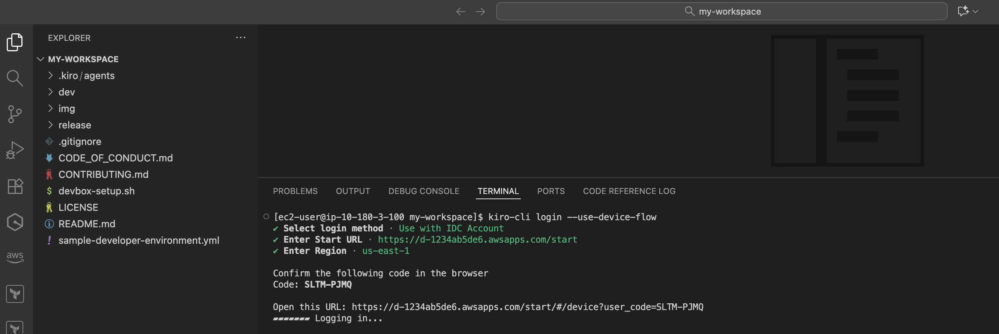
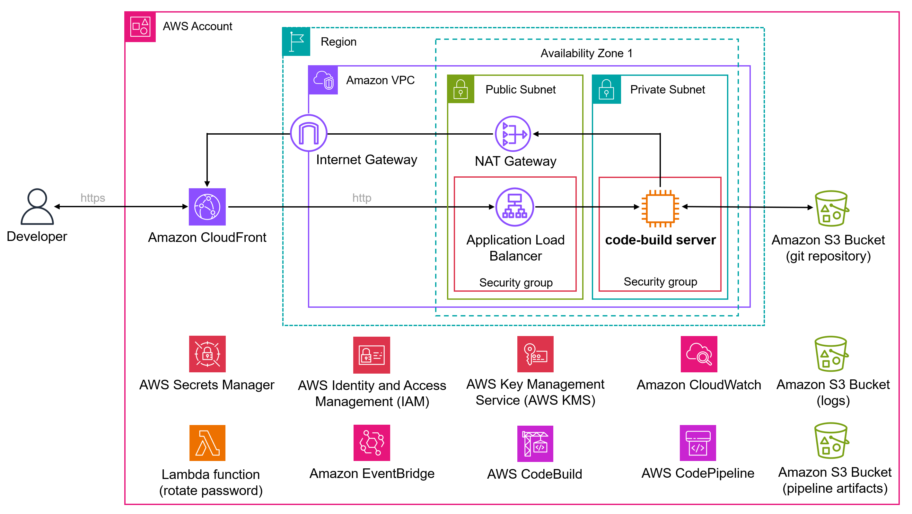
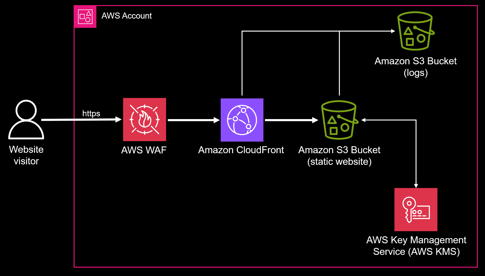
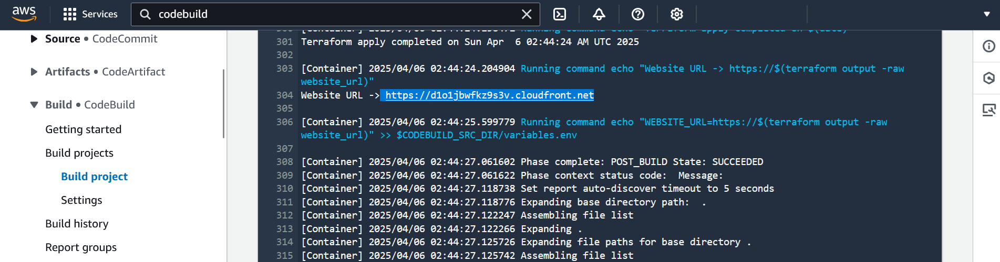

# sample-developer-environment

This solution deploys a complete browser-based development environment with VS Code, version control, and automated deployments using a single AWS CloudFormation template.

> 🚀 Now includes [Kiro IDE](https://kiro.dev/docs/) and [Kiro CLI](https://kiro.dev/docs/cli)

## Quick Navigation
- [Repository Structure](#repository-structure)
- [Key Features](#key-features)
- [Quick Start](#quick-start)
- [Configuration Options](#configuration-options)
- [Useful File locations](#useful-file-locations)
- [Kiro Setup](#kiro-setup)
- [AWS IAM Roles](#aws-iam-roles)
- [Architecture](#architecture)
- [Sample Application](#sample-application)
- [Security Considerations](#security-considerations)

## Repository Structure

```
.
├── .amazonq/                         # Amazon Q CLI workspace configuration directory
│   └── cli-agents/                   # Agent configuration directory
│       └── platform-engineer.json    # Platform engineering agent with MCP servers
│       └── data-engineer.json        # Data engineering agent with MCP servers
├── dev/                              # Development workspace
│   └── README.md                     # Development guide
├── release/                          # Sample Terraform application
│   ├── main.tf                       # Core infrastructure
│   ├── provider.tf                   # AWS provider configuration
│   ├── variables.tf                  # Input variables
│   ├── versions.tf                   # Provider versions and backend
│   ├── website.tf                    # Sample static website
│   └── terraform.tfvars              # Variable defaults
│── devbox-setup.sh                   # EC2 Bootstrap script
└── sample-developer-environment.yml  # Main CloudFormation template
```

## Key Features

- Browser-based VS Code using [code-server](https://github.com/coder/code-server) accessed through Amazon CloudFront
- [Kiro CLI](https://kiro.dev/docs/cli) with pre-configured MCP servers for platform and data engineering
- Optional desktop environment with [Kiro IDE](https://kiro.dev/docs/) accessed through DCV
- Git version control using [git-remote-s3](https://github.com/awslabs/git-remote-s3) with Amazon S3 storage
- Automated deployments using AWS CodePipeline and AWS CodeBuild
- Password rotation using AWS Secrets Manager (30-day automatic rotation)
- Pre-configured AWS development environment:
  - AWS Toolkit for VS Code
  - Terraform infrastructure deployment
  - Docker support
  - Git integration

## Quick Start

1. Launch the AWS CloudFormation template `sample-developer-environment.yml`
2. Choose your initial workspace content:
   - Provide a GitHub repository URL in `GitHubRepo` parameter, OR
   - Provide S3 bucket name `S3AssetBucket` and `S3AssetPrefix` parameters
3. Access VS Code through the provided CloudFormation output URL
4. Get your password from AWS Secrets Manager (link in outputs)
5. Click *File* > *Open Folder* and navigate to `/home/ec2-user/my-workspace`. This is the git/S3 initialized project directory
6. Test code in `dev`, copy to `release`, commit and push to trigger deployment


## Configuration Options

| Parameter | Description |
|-----------|-------------|
| `CodeServerVersion` | Version of code-server to install |
| `GitHubRepo` | Public repository to clone as initial workspace. Note: Using a custom repository will not include the sample application |
| `GitHubBranch` | GitHub branch to use for devbox-setup.sh script (default: main) |
| `S3AssetBucket` | (Optional) S3 bucket containing initial workspace content. Overwrites GitHubRepo if provided |
| `S3AssetPrefix` | (Optional) S3 bucket asset prefix path. Only required when S3AssetBucket is specified. Needs to end with `/` |
| `DeployPipeline` | Enable AWS CodePipeline deployments |
| `RotateSecret` | Enable AWS Secrets Manager rotation |
| `AutoSetDeveloperProfile` | Automatically set Developer profile as default in code-server terminal sessions without requiring manual elevation |
| `EnableKiroIDE` | Enable Kiro IDE desktop application with DCV |
| `InstallDotNet` | Install .NET SDK  |
| `InstanceArchitecture` | Choose between ARM (arm64) and x86 (amd64) architecture (Kiro IDE requires x86) |
| `InstanceType` | Pick Amazon EC2 instance type (t3a.large and up recommended for Kiro IDE) |

## Useful File Locations

Here are some handy files you'll find on the EC2 instance:

| File | Description |
|------|-------------|
| `/etc/devbox-env.sh` | Environment variables file |
| `/var/lib/cloud/instance/setup-status.log` | Installation status tracking file |
| `/var/lib/cloud/scripts/per-boot/setup.sh` | Setup script location (runs on every boot) |
| `/var/log/devbox-setup.log` | Log file for setup script output |

## Kiro Setup

### Prerequisites

1. [Enable IAM Identity Center](https://docs.aws.amazon.com/singlesignon/latest/userguide/confirm-identity-source.html) if you haven't already
2. [Create an IAM Identity Center user](https://docs.aws.amazon.com/singlesignon/latest/userguide/addusers.html) if needed
3. Follow the [Subscribing your team to Kiro](https://kiro.dev/docs/enterprise/subscribe/) guide

### Kiro CLI

From the code-server terminal:

1. Run `kiro-cli login --use-device-flow` and follow prompts for headless authentication

    

2. Navigate to workspace: `cd /home/ec2-user/workspace/my-workspace`
3. (optional) Set the default agent: `kiro-cli settings chat.defaultAgent platform-engineer`
4. Start with `kiro-cli` or `kiro-cli --agent platform-engineer`
5. Use `/model` to select AI model, `/tools` to see available MCP tools
6. Browse [AWS Labs MCP](https://github.com/awslabs/mcp) for additional MCP servers
7. Create additional agents by adding new files to `.kiro/agents/`
8. Use Kiro CLI to accelerate your development 🚀

### Kiro IDE (Desktop Application)

When `EnableKiroIDE=true`, access the full desktop environment through DCV using either a web browser or Amazon DCV Client:

### Browser Access
1. Get the DCV connection URL from CloudFormation stack outputs (DCVWebUrl)
2. Login with username and password from Secrets Manager
3. Launch Kiro IDE from the applications menu or run `kiro-ide` in terminal
4. Firefox opens automatically for IAM Identity Center authentication (may take ~10 seconds)

ℹ️ **Tip:** Having issues with copy/paste? See the [DCV copy/paste documentation](https://docs.aws.amazon.com/dcv/latest/userguide/using-copy-paste.html).

### Amazon DCV Client
For better performance and additional features, use the Amazon DCV Client:

1. [Download Amazon DCV Client](https://download.nice-dcv.com/) for your operating system
2. Get the DCV connection URL from CloudFormation stack outputs (DCVWebUrl)
3. Open the DCV Client and connect using the URL
4. Login with username and password from Secrets Manager
5. Launch Kiro IDE from the applications menu or run `kiro-ide` in terminal
6. Firefox opens automatically for IAM Identity Center authentication if required (may take ~10 seconds)

## AWS IAM Roles

The environment is configured with two IAM roles:
1. EC2 instance role - Basic permissions for the instance
2. Developer role - Elevated permissions for AWS operations

The developer role has the permissions needed to deploy the sample application. To view or modify these permissions, search for "iamroledeveloper" in the CloudFormation template.

This separation ensures the EC2 instance runs with minimal permissions by default, while allowing controlled elevation of privileges when needed.

ℹ️ **Tip**: Run `echo 'export AWS_PROFILE=developer' >> ~/.bashrc && source ~/.bashrc` to make the developer profile default for all terminal sessions.

If you wish to have elevated AWS permissions automatically enabled in all new terminal sessions without requiring manual profile switching, set `AutoSetDeveloperProfile` to true. While convenient, this bypasses the security practice of explicit privilege elevation.

## Architecture

The environment runs in a private subnet with CloudFront access, using S3 for git storage and CodePipeline for automated deployments.



## Sample Application

ℹ️ **Note**: The sample application is only available when using the default value for `GitHubRepo`. If you specify either a custom `GitHubRepo` or `S3AssetBucket`, you will need to provide your own Terraform application code.

The repository includes a Terraform application that deploys:
- Static website hosted on Amazon S3
- Amazon CloudFront distribution with AWS WAF protection
- Security headers and AWS KMS encryption
- Amazon CloudWatch logging



The application deploys automatically when you set the CloudFormation parameter `DeployPipeline` to true. Once deployment completes, you can locate the website URL in the final output of the CodeBuild job.



⚠️ **WARNING**: If using CodePipeline (DeployPipeline=true), before removing the CloudFormation stack:
1. Run the 'terraform-destroy' pipeline in CodePipeline
2. Approve the manual approval step when prompted
3. Wait for pipeline completion

Failing to run and approve the destroy pipeline will leave orphaned infrastructure resources in your AWS account that were created by Terraform and will need to be cleaned up manually.

## Security Considerations

⚠️ **IMPORTANT**: This sample uses HTTP for internal traffic between the Application Load Balancer and code-server Amazon EC2 instance. While external traffic is secured through CloudFront HTTPS, it is strongly recommended to:
- Configure end-to-end HTTPS using custom SSL certificates on the ALB
- Update ALB listener and target group to use HTTPS/443
- Use a custom domain name with AWS Certificate Manager (ACM) certificates

## Security

See [CONTRIBUTING](CONTRIBUTING.md#security-issue-notifications) for more information.

## License

This library is licensed under the MIT-0 License. See the LICENSE file.

## Disclaimer

**This repository is intended for demonstration and learning purposes only.**
It is **not** intended for production use. The code provided here is for educational purposes and should not be used in a live environment without proper testing, validation, and modifications.
Use at your own risk. The authors are not responsible for any issues, damages, or losses that may result from using this code in production.