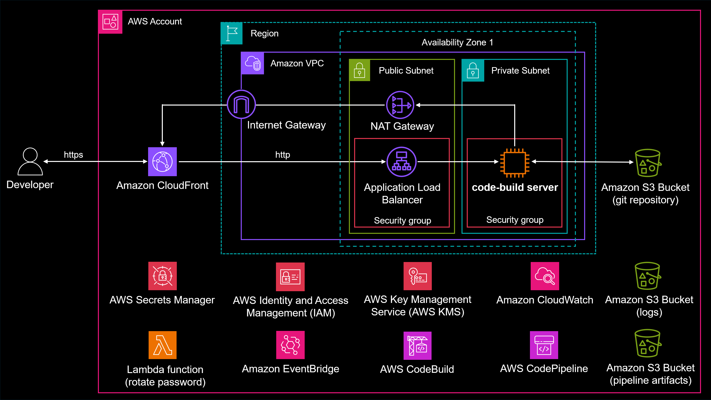
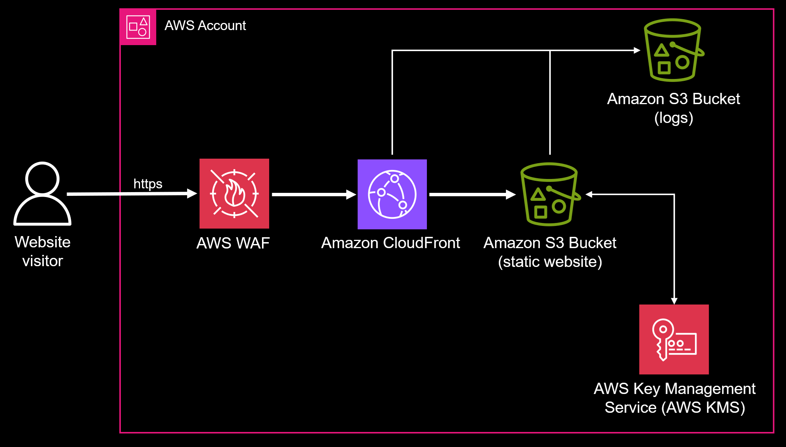
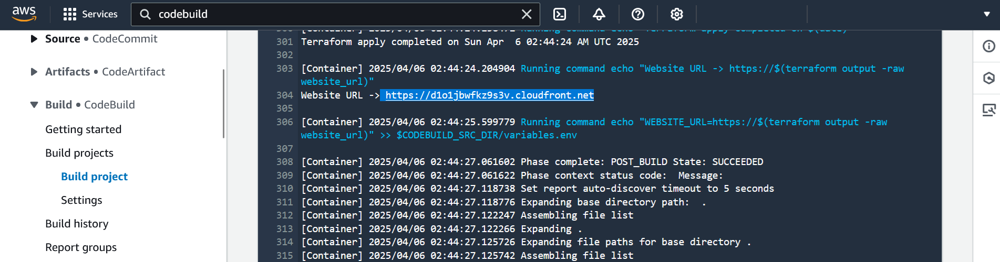

# sample-developer-environment

This solution deploys a complete browser-based development environment with VS Code, version control, and automated deployments using Terraform.

> Note: Looking for the CloudFormation version? Check the [main branch](../../tree/main).

## Repository Structure

```
.
├── dev/                           # Development workspace
│   └── README.md                  # Development guide
├── release/                       # Sample Terraform application
│   ├── main.tf                    # Core infrastructure
│   ├── outputs.tf                 # Stack outputs
│   ├── provider.tf                # AWS provider configuration
│   ├── terraform.tfvars           # Variable defaults
│   ├── variables.tf               # Input variables
│   ├── versions.tf                # Provider versions and backend
│   └── website.tf                 # Sample static website
└── terraform/                     # Core Terraform configuration
├── modules/                       # Reusable modules
│   ├── git-bucket/                # S3 git remote module
│   │   ├── main.tf                # Bucket and policy configuration
│   │   ├── outputs.tf             # Module outputs
│   │   └── variables.tf           # Module variables
│   └── git-pipeline/              # Pipeline module
│       ├── main.tf                # Pipeline configuration
│       └── variables.tf           # Module variables
├── buildspec/                     # CodeBuild buildspecs
│   └── sample_application/
│       ├── build.yml              # Build pipeline spec
│       └── destroy.yml            # Destroy pipeline spec
├── developer_workstation.tf       # Core workstation infrastructure
├── iam_developer_role.tf          # Developer profile IAM roles and policies
├── instance_user_data.sh          # EC2 user data script
├── optional_deploy_pipeline.tf    # Optional pipeline resources
├── optional_rotate_secret.tf      # Optional secret rotation
├── outputs.tf                     # Stack outputs
├── provider.tf                    # AWS provider configuration
├── terraform.tfvars               # Variable values
├── variables.tf                   # Input variables
└── versions.tf                    # Provider versions
```

## Key Features

- Browser-based VS Code using [code-server](https://github.com/coder/code-server) accessed through Amazon CloudFront
- Git version control using [git-remote-s3](https://github.com/awslabs/git-remote-s3) with Amazon S3 storage
- Automated deployments using AWS CodePipeline and AWS CodeBuild
- Password rotation using AWS Secrets Manager (30-day automatic rotation)
- Pre-configured AWS development environment:
  - AWS Toolkit for VS Code
  - Terraform infrastructure deployment
  - Docker support
  - Git integration

## Quick Start

1. Navigate to the `terraform` directory
2. Configure your variables in `terraform.tfvars`:
   - Provide a GitHub repository URL in `github_repo` parameter, OR
   - Provide S3 bucket name `s3_asset_bucket` and `s3_asset_prefix` parameters
3. Initialize and apply Terraform:
    ```
    terraform init
    terraform apply
4. Access VS Code through the Terraform output URL provided
5. Get your password from AWS Secrets Manager (link in outputs)
6. Click *File* > *Open Folder* and navigate to `/home/ec2-user/my-workspace`. This is the git/S3 initialized project directory
7. Test code in `dev`, copy to `release`, commit and push to trigger deployment


## Configuration Options

| Parameter | Description | Default |
|-----------|-------------|---------|
| `prefix_code` | Resource naming prefix | "devbox" |
| `deploy_pipeline` | Enable AWS CodePipeline deployments | false |
| `rotate_secret` | Enable AWS Secrets Manager rotation | false |
| `code_server_version` | Version of code-server to install | "4.98.2" |
| `github_repo` | Public repository to clone as initial workspace | "https://github.com/aws-samples/sample-developer-environment.git"
| `s3_asset_bucket` | (Optional) S3 bucket containing initial workspace content | "" |
| `s3_asset_prefix` | (Optional) S3 bucket asset prefix path (must end in '/') | "" |
| `auto_set_developer_profile` | Set Developer profile as default in terminal sessions | false |
| `instance_type` | EC2 instance type (supports ARM and x86) | false | "t4g.large" |

## AWS IAM Roles

The environment is configured with two IAM roles:
1. EC2 instance role - Basic permissions for the instance
2. Developer role - Elevated permissions for AWS operations

The developer role has the permissions needed to deploy the sample application. To view or modify these permissions, edit `iam_developer_role.tf`.

This separation ensures the EC2 instance runs with minimal permissions by default, while allowing controlled elevation of privileges when needed.

ℹ️ **Tip**: Run `echo 'export AWS_PROFILE=developer' >> ~/.bashrc && source ~/.bashrc` to make the developer profile default for all terminal sessions.

If you wish to have elevated AWS permissions automatically enabled in all new terminal sessions without requiring manual profile switching, set `auto_set_developer_profile` to true. While convenient, this bypasses the security practice of explicit privilege elevation.

## Architecture

The environment runs in a private subnet with CloudFront access, using S3 for git storage and CodePipeline for automated deployments.



## Sample Application

ℹ️ **Note**: The sample application is only available when using the default value for `GitHubRepo`. If you specify either a custom `GitHubRepo` or `S3AssetBucket`, you will need to provide your own Terraform application code.

The repository includes a Terraform application that deploys:
- Static website hosted on Amazon S3
- Amazon CloudFront distribution with AWS WAF protection
- Security headers and AWS KMS encryption
- Amazon CloudWatch logging



The application deploys automatically when you set the CloudFormation parameter `DeployPipeline` to true. Once deployment completes, you can locate the website URL in the final output of the CodeBuild job.



⚠️ **WARNING**: If using CodePipeline (DeployPipeline=true), before removing the CloudFormation stack:
1. Run the 'terraform-destroy' pipeline in CodePipeline
2. Approve the manual approval step when prompted
3. Wait for pipeline completion

Failing to run and approve the destroy pipeline will leave orphaned infrastructure resources in your AWS account that were created by Terraform and will need to be cleaned up manually.

## Security Considerations

⚠️ **IMPORTANT**: This sample uses HTTP for internal traffic between the Application Load Balancer and code-server Amazon EC2 instance. While external traffic is secured through CloudFront HTTPS, it is strongly recommended to:
- Configure end-to-end HTTPS using custom SSL certificates on the ALB
- Update ALB listener and target group to use HTTPS/443
- Use a custom domain name with AWS Certificate Manager (ACM) certificates

## Security

See [CONTRIBUTING](CONTRIBUTING.md#security-issue-notifications) for more information.

## License

This library is licensed under the MIT-0 License. See the LICENSE file.

## Disclaimer

**This repository is intended for demonstration and learning purposes only.**
It is **not** intended for production use. The code provided here is for educational purposes and should not be used in a live environment without proper testing, validation, and modifications.
Use at your own risk. The authors are not responsible for any issues, damages, or losses that may result from using this code in production.